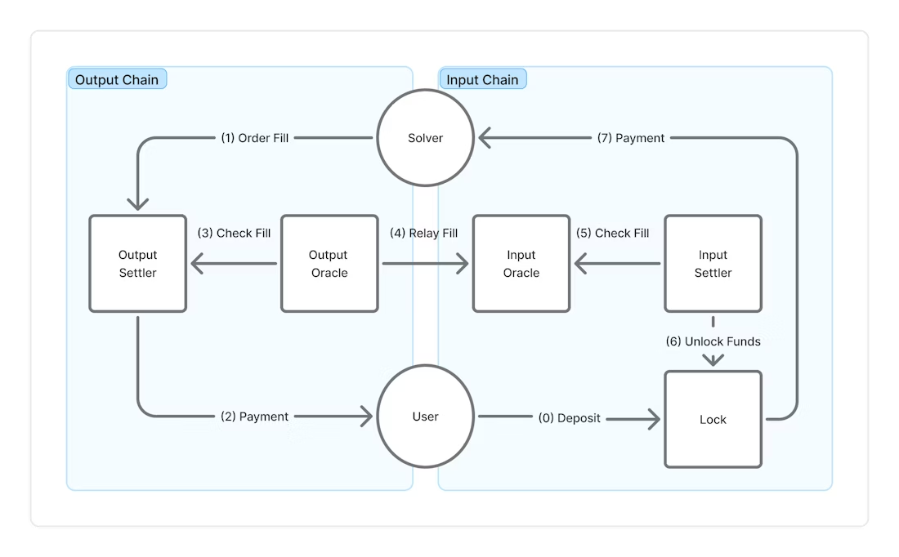

# Web3 闪电贷攻防：从被动防守到架构进化

## 一、引言

2020 年 2 月，bZx 协议在两天内被连续攻击，损失近百万美元。攻击者没有写任何特别复杂的代码，也没有动用自有资金——他们只是借了一笔钱，在同一笔交易里完成了所有操作，然后还了回去。

这就是闪电贷。作为 DeFi 的原生金融原语，闪电贷本身是中性的：它让套利者平衡市场价格，让清算者高效处理坏账，让开发者无需资金就能测试复杂策略。但同一把刀，也能用来攻击那些设计存在缺陷的协议。

真正的问题不是闪电贷本身，而是 DeFi 执行层在设计上留下的裂缝。

---

## 二、闪电贷攻击拆解

### 原子性：攻击的核心前提

区块链交易具有原子性——一笔交易要么完整执行，要么全部回滚。闪电贷正是利用了这一特性：在单笔交易内，攻击者可以：

1. 从协议借入大量资产（无需抵押）
2. 用借来的资产操纵市场或触发漏洞
3. 套取利润
4. 在交易结束前归还本金

整个过程发生在同一个区块内，历时不超过几秒。

### 三条经典攻击路径

**路径一：预言机操纵**
协议依赖 DEX 现货价格作为资产定价依据。攻击者借入巨额资产，在单个区块内砸高或压低某代币的现货价，欺骗协议按错误价格执行清算或借贷，再恢复价格后套利。

**路径二：协议逻辑漏洞**
部分协议在执行顺序或权限校验上存在设计缺陷。攻击者通过闪电贷获得大额持仓后，触发协议内的特定逻辑路径——如治理投票、奖励计算——完成套利。

**路径三：跨协议组合**
DeFi 的可组合性也是攻击面。攻击者在同一笔交易内跨越多个协议，利用各协议之间的状态不一致完成套利。

### 典型案例

- **bZx（2020）**：攻击者借入 ETH，在 Uniswap 操纵 WBTC 现货价，再通过 bZx 按虚高价格借出更多资产，净获利约 36 万美元。
- **Euler Finance（2023）**：攻击者利用 Euler 捐赠函数逻辑漏洞，通过闪电贷触发错误的清算逻辑，损失约 1.97 亿美元（后经谈判部分归还）。

---

## 三、防护方法一：预言机加固

### 现货价格为何不可信

DEX 现货价格（spot price）反映的是当前区块的瞬时状态。任何人只要资金足够，都可以在单个区块内将价格推向极端值，交易结束后价格自然回归。依赖现货价格的协议，等于把定价权交给了资金最充裕的人。

### TWAP：时间加权均价

TWAP（Time-Weighted Average Price）对多个区块的价格取加权均值。即便攻击者在某一区块内将价格推高十倍，其对 TWAP 的影响也被时间窗口内的其他区块稀释，无法在单笔交易内完成有效操纵。

Uniswap V2/V3 均内置了 TWAP 预言机接口，是目前最广泛使用的抗闪电贷价格来源之一。

### 多源预言机组合

单一预言机存在故障或操纵风险，生产环境建议组合使用：

- **Chainlink**：链下数据聚合，提供去中心化喂价，适合主流资产
- **DEX TWAP**：链上原生数据，无需信任第三方
- **两者取中位数或设偏差阈值**：任一来源异常时触发熔断

---

## 四、防护方法二：合约层防御

### 重入锁（Reentrancy Guard）

重入攻击与闪电贷常见组合：在协议向攻击者转账的过程中，攻击者合约的 `fallback` 函数被触发，再次调用协议。重入锁通过状态变量确保函数执行期间不可被重复进入：

```solidity
modifier nonReentrant() {
    require(!locked, "Reentrant call");
    locked = true;
    _;
    locked = false;
}
```

OpenZeppelin 的 `ReentrancyGuard` 是标准实现，几乎所有 DeFi 协议都应引入。

### CEI 模式（Checks-Effects-Interactions）

正确的合约执行顺序：先完成所有检查（Checks），再更新内部状态（Effects），最后才与外部合约交互（Interactions）。将外部调用放在最后，即便外部合约恶意回调，协议状态已经更新完毕，攻击者无法利用旧状态套利。

### 同区块操作限制

对于敏感操作组合（如存款 + 立即借贷、借款 + 立即清算），可在合约层记录上次操作的区块号，拒绝同一区块内的连续敏感操作：

```solidity
mapping(address => uint256) public lastActionBlock;

modifier notSameBlock() {
    require(block.number > lastActionBlock[msg.sender], "Same block");
    lastActionBlock[msg.sender] = block.number;
    _;
}
```

### 操作金额熔断

对单笔操作的金额设置上限，或对短时间内的累计操作量设置阈值。异常大额操作触发暂停或延迟，为治理介入留出时间窗口。

---

## 四·五、Token 层防护：把防线嵌入代币合约本身

协议层的防护保护的是系统整体。如果你在开发 ERC20 代币，还可以把闪电贷抵抗力直接内置到代币合约中——从资产层打断原子性假设。

核心逻辑：闪电贷依赖**零成本、零时间、原子性**执行。Token 层防护在合约内部引入**成本壁垒**、**时间壁垒**和**身份壁垒**，让闪电贷合约无法满足交易前提。

十种具体策略，按威胁向量分类：

| 策略 | 针对威胁 | 机制 |
|---|---|---|
| **成本追踪** | 零成本代币套利 | 按持仓成本基础限制最大利润；闪电借入的代币成本为零，利润空间为零 |
| **合约地址检测**（EIP-7702 感知） | 合约调用链攻击 | 拦截智能合约调用者，仅允许 EOA 交互 |
| **同区块冷却** | 同块买入→卖出 | 追踪每个地址的最近转入区块号，拒绝同块卖出 |
| **单地址交易量限制** | 大额操控 | 限制单笔及周期内累计交易量 |
| **最小余额保留** | 全额余额抽取 | 每次转账后强制保留最小余额 |
| **大额卖出保护** | 前置卖单抢跑 | 大额卖出触发费率提升或回购机制 |
| **累进卖出税** | 短持仓翻转攻击 | 持仓时间越短税率越高，闪电贷持仓时间≈0 → 税率最高 |
| **生态利润税** | 生态价值抽取 | 额外卖出税导向生态价值积累 |
| **基础交易费** | 零成本往返 | 买卖均收费，配合 AMM 滑点形成最低往返成本 |
| **推荐绑定** | 匿名合约交互 | 首次交易需推荐激活；闪电贷合约无推荐关系，无法交易 |

四个防护等级，按项目风险量级选择：

| 等级 | 策略组合 | 适用场景 |
|---|---|---|
| 基础 | 同区块冷却 + 交易量限制 + 基础费 | 标准代币，基本防护 |
| 标准 | 合约检测 + 冷却 + 交易量 + 最小余额 + 累进税 + 基础费 | 社区代币，中等价值 |
| 进阶 | 成本追踪 + 全部标准策略 + 生态利润税 | 高价值 DeFi 代币 |
| 最高 | 全部 10 种策略 | NFT 生态 + 子代币 + 高 TVL |

> **工具推荐**：[solidity-agent-kit](https://github.com/0xlayerghost/solidity-agent-kit) 的 [`token-antiflash`](https://www.skills.sh/0xlayerghost/solidity-agent-kit) skill 将上述策略编码为 AI 可调用的设计系统。它不直接全量实现所有策略，而是先评估项目威胁模型，展示策略决策矩阵，与开发者确认参数后再实现——避免过度防护带来的 gas 浪费和 UX 损耗。配合 `defi-security` skill 可覆盖协议层的 MEV 防御和紧急暂停机制。
>
> ```bash
> npx skills add 0xlayerghost/solidity-agent-kit
> ```
> 目前 784 次安装，11 个 skill 模块，涵盖合约编写、安全审计、测试、部署全流程。

---

## 五、从防守到架构：执行层的范式转变

以上防护手段本质上都是"打补丁"——针对已知攻击向量逐一加固。这种思路没有问题，但它没有触及一个更深层的结构性问题：

**传统 AMM 架构让流动性池同时扮演了两个角色：流动性来源和价格参考。**

这两个角色的叠加，正是闪电贷攻击最根本的利用前提。攻击者能够操纵价格，是因为价格本身就来自可操纵的池子。执行路径完全公开，攻击者在提交交易前就能计算出完整的套利路径。

### 意图式架构：改变攻击面本身

近年来兴起的意图式架构（Intent-based Architecture）从执行层重新设计了这一问题。其核心思想是：**用户只声明目标结果，执行路径由专业方在链下决定。**

以 LI.FI 推出的 **LI.FI Intents** 为例，其架构将传统意图流程中历来耦合的三个组件显式拆分：

- **Input Settler**（源链）：接收并锁定用户资金，验证交付证明后释放
- **Output Settler**（目标链）：接收 Solver 的填充操作，生成交付证明
- **Oracle**：将目标链的交付证明传递回源链

实际的资金流向如下：

```
用户资产（源链）
    ↓ 锁入 InputSettlerEscrow 合约
智能合约托管（非 LI.FI 持有）
    ↓ 意图广播至 Solver 网络
Solver 用自有资本在目标链垫付资产 → 用户收到 token
    ↓ Oracle 验证交付（Polymer / Wormhole）
合约释放源链锁定资金给 Solver
```

这是一个**货到付款**模型：Solver 先送货，Oracle 核实，合约再付款。用户资金始终由开源智能合约（[OIF 合约](https://github.com/openintentsframework/oif-contracts)）保管，不由任何中心化方持有。

### 架构变化带来的安全含义

从文档记载的事实出发，可以观察到以下架构特性：

- **无链上 LP 池**：Solver 使用自有资本执行，不存在可被现货操纵的流动性池
- **执行路径链下决定**：Solver 监听链上 `Open` 事件后独立决定是否接单及如何执行，攻击者无法在提交意图时预知并构造套利路径
- **执行风险由 Solver 承担**：Solver 先行垫付，若执行失败损失由 Solver 自担，协议设计上将风险分配给了专业履约方

这些不是专门针对闪电贷设计的防护机制，而是意图式架构的固有特性——它改变的是执行层的结构，而非在原有结构上添加防护。

### LI.FI Intents 的定位

LI.FI Intents 面向希望将金融产品带上链的企业，提供三类能力：

- **稳定币支付**：跨链稳定币结算基础设施
- **真实世界资产（RWA）访问**：接入合规链上资产
- **合规链上流动性**：通过竞争性 Solver 网络获取最优执行

合约部署在 Ethereum、Base、Arbitrum 等主流网络，地址跨链统一，代码开源可审计。

---

## 六、结语

DeFi 的安全历史，是一部从被动修补到主动设计的进化史。

TWAP 预言机、重入锁、CEI 模式、Token 层防护——这些工具解决了具体的攻击向量，是每一位合约开发者必须掌握的基础。[solidity-agent-kit](https://github.com/0xlayerghost/solidity-agent-kit) 将这些模式编码为 AI skill，让你在开发时随时调用而不用从头查文档。但安全的天花板，最终取决于架构的起点。

意图式架构代表的方向是：**将复杂的执行逻辑从协议层剥离，交由专业的 Solver 网络承担，用户只需关心结果。** 这在降低用户认知门槛的同时，也从结构上收窄了攻击面。

正如 LI.FI 宣传视频里那句字幕所说：*"But the reality is the user experience still freaking sucks."* 意图架构试图同时解决两个问题：让链上交互更安全，也让它真正可用。

---

*本文关于 LI.FI Intents 的技术描述均基于[官方文档](https://docs.li.fi/lifi-intents/introduction)，架构图及安全含义分析为笔者观点。*
